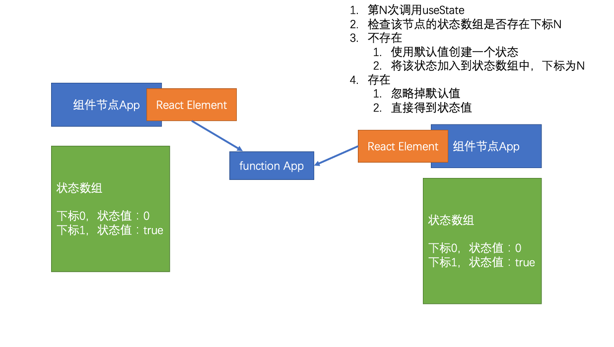

# State Hook

State Hook 是一个在函数组件中使用的函数（useState），用于在函数组件中使用状态

### useState

- 函数有一个参数，该参数的值表示状态的默认值
- 函数的返回值是一个数组，该数组一定包含两项
  - 第一项：当前状态的值
  - 第二项：改变状态的函数

一个函数组件中可以有多个状态，这种做法非常有利于横向切分关注点

### State Hook 原理

1. 当运行一个函数组件时（调用该函数）
   

**注意的细节**

1. useState 最好写到函数的起始位置，便于阅读
2. useState 严禁出现在代码块（判断、循环）中
3. useState 返回的函数（数组第二项），引用不变（节约内存空间）
4. 如果使用函数改变数据，若数据和之前的数据完全相等（使用 Object.is 比较），不会导致重新渲染，以达到优化效率的目的
5. 使用函数改变数据，传入的值不会和原来的数据进行合并，而是直接替换
6. 如果要实现强制刷新组件
   1. 类组件：使用 forceUpdate 函数
   2. 函数组件：使用一个空对象的 useState
7. **如果某些状态直接没有必然的联系，应该分化为不同的状态，而不要合并成一个对象**
8. 和类组件的状态一样，函数组件中改变状态可能是异步的（在 DOM 事件中），多个状态变化会合并以提高效率，此时，不能信任之前的状态，而应该使用回调函数的方式改变状态。如果状态变化要使用到之前的状态，尽量传递函数。
